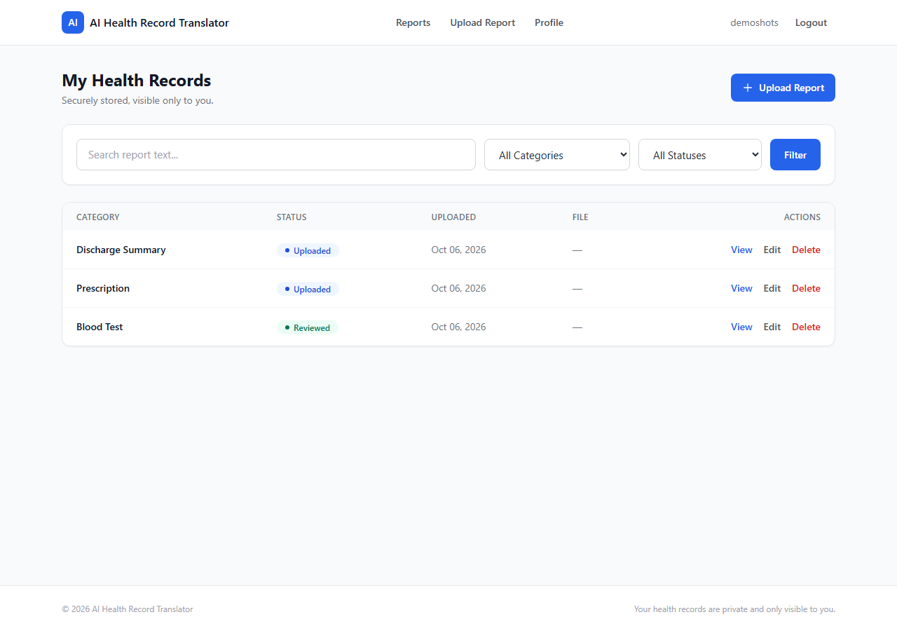
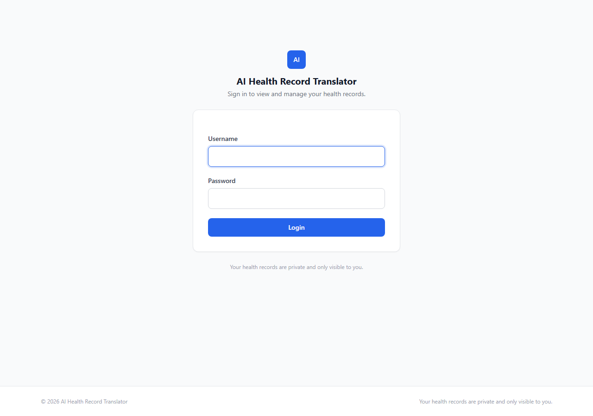
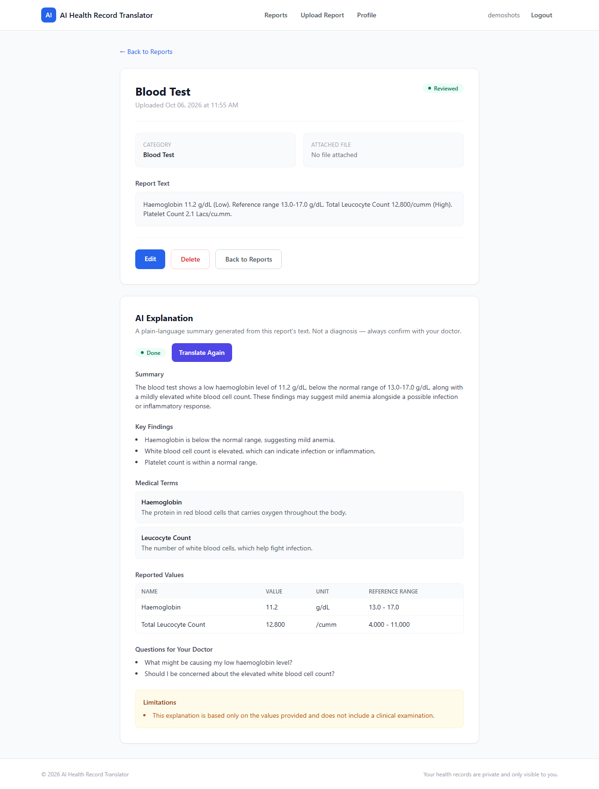
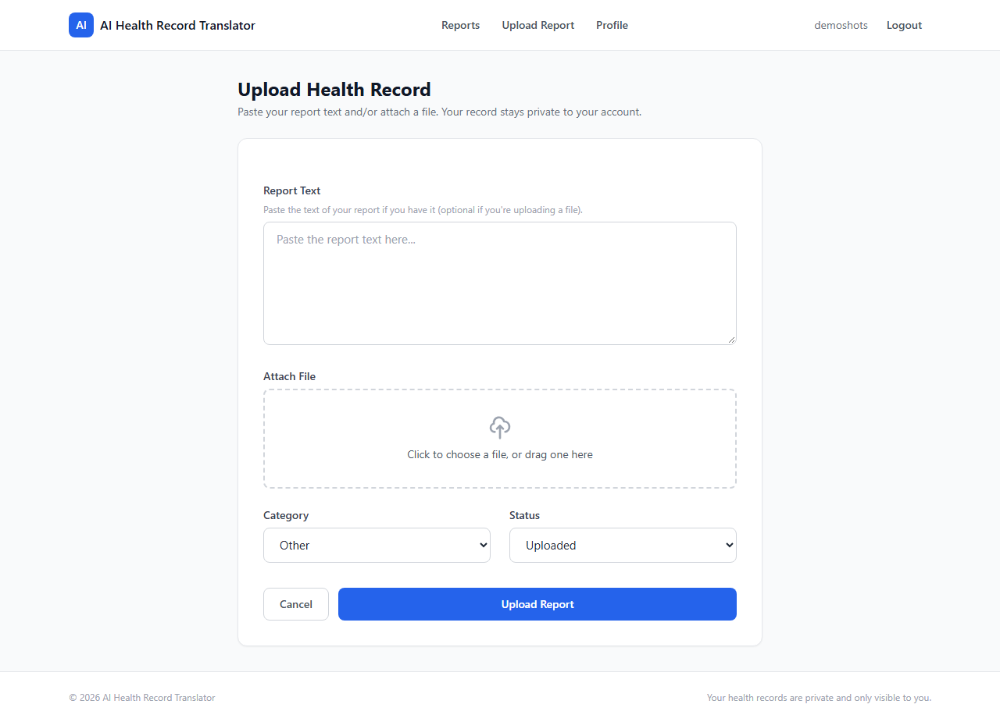

# AI Health Record Translator

A Django web application that helps people understand their own medical reports. Users upload a lab report (PDF or image) or paste the text directly; the app extracts the content, sends it to an LLM with a strict structured-output schema, and displays a plain-language explanation — summary, key findings, explained medical terms, reported values with reference ranges, questions to ask a doctor, and stated limitations.

AI processing runs asynchronously via Celery + Redis, so uploading and translating never blocks the web request. The frontend polls a small Django JSON endpoint to detect when processing finishes, with no direct browser-to-Redis/Celery communication.

> **This is not a medical diagnostic tool.** See [Medical Safety](#medical-safety).



---

## Table of Contents

- [Why This Project Is Interesting](#why-this-project-is-interesting)
- [Tech Stack](#tech-stack)
- [System Architecture](#system-architecture)
- [Project Workflow](#project-workflow)
- [Features](#features)
- [Folder Structure](#folder-structure)
- [API / Routes](#api--routes)
- [Setup / Installation](#setup--installation)
- [Environment Variables](#environment-variables)
- [Running Tests](#running-tests)
- [Error Handling](#error-handling)
- [Design & Engineering Decisions](#design--engineering-decisions)
- [Known Limitations](#known-limitations)
- [Roadmap](#roadmap)
- [Medical Safety](#medical-safety)
- [Screenshots](#screenshots)

---

## Why This Project Is Interesting

This project is a working example of running LLM processing in a traditional synchronous web framework without blocking requests, with the operational rough edges that come with it:

- **Asynchronous AI processing** — Celery + Redis move the (several-second) LLM call off the request/response cycle. Redis is split into two logical databases: DB 0 for the broker, DB 1 for the result backend.
- **Structured LLM output, enforced** — the Groq call uses `response_format: {"type": "json_schema", "strict": true}` with an explicit schema (required fields, `additionalProperties: false`), plus a second validation pass in Django before anything is saved, so a malformed model response fails cleanly instead of corrupting data.
- **Document extraction pipeline with a real fallback chain** — PDF text-layer extraction first (`pdfplumber`, fast and free), falling back to rasterizing pages (`pymupdf`) and sending them to a vision-capable LLM only when there's no usable embedded text.
- **Frontend polling without exposing infrastructure** — the browser never talks to Redis or Celery; it polls a Django view that reads `Translation.processing_status` from PostgreSQL/SQLite. Polling is capped (60 attempts) and self-stops on completion, failure, or timeout.
- **Two real race conditions found and fixed during development** — (1) the first page shown right after clicking "Translate" could render before the Celery worker had created the `Translation` row, showing a stale "not started" state with a re-clickable button; (2) the same race reappeared on retry, where a stale `done`/`failed` row could persist through a new translate click. Both were root-caused and fixed by resetting `Translation.processing_status` synchronously in the view before queuing the task — a small, deliberate fix rather than a rewrite. This kind of async-UI correctness problem is a genuine, common production issue.
- **Deliberate data modeling for provenance** — `raw_text` (what the user typed) and `extracted_text` (what the pipeline pulled from a file) are kept as separate fields so an automated extraction/OCR pass can never silently overwrite text a person wrote themselves.
- **Privacy-aware access control** — every report-related view filters by `user=request.user` and returns `404` (not `403`) for another user's report, so the app never reveals that a given report ID exists at all.

---

## Tech Stack

| Layer | Technology |
|---|---|
| Backend framework | Django 5.2 (Python 3.11) |
| Frontend | Django templates, Tailwind CSS (CDN), vanilla JavaScript (no build step, no framework) |
| Database | SQLite (current default, see [Known Limitations](#known-limitations)) |
| Async task queue | Celery |
| Message broker / result backend | Redis (two logical databases) |
| AI / LLM provider | Groq API (`groq` Python SDK) |
| Document processing | `pdfplumber` (PDF text extraction), `PyMuPDF` / `pymupdf` (PDF page rasterization) |
| Auth | Django's built-in `django.contrib.auth` |
| Testing | Django's built-in `TestCase` (`unittest`), 25 tests |
| Local infra (optional) | Docker Compose (PostgreSQL 16 + Redis 7 containers) |

There is no Django REST Framework, no vector database, and no RAG pipeline in this codebase — see [Roadmap](#roadmap) for what's planned versus what's shipped.

---

## System Architecture

```text
                         ┌──────────────────────┐
                         │          User          │
                         └───────────┬────────────┘
                                     │ HTTP
                                     ▼
                         ┌──────────────────────┐
                         │  Django Templates     │
                         │   + Tailwind CSS      │
                         │  (JS polling client)  │
                         └───────────┬────────────┘
                                     │
                                     ▼
                         ┌──────────────────────┐
                         │     Django Views       │
                         │ auth · CRUD · status   │
                         └─────┬─────────┬───────┘
                               │         │
              synchronous      │         │ process_report.delay(id)
        extraction (upload)    │         ▼
     pdfplumber / PyMuPDF /    │   ┌─────────────────┐
         Groq vision           │   │  Redis (DB 0)    │  Celery broker
                               │   └────────┬────────┘
                               │            ▼
                               │   ┌─────────────────┐
                               │   │  Celery Worker   │
                               │   └────────┬────────┘
                               │            │ translate_report()
                               │            ▼
                               │   ┌─────────────────┐
                               │   │  Groq LLM API    │
                               │   │ (strict JSON     │
                               │   │  schema output)  │
                               │   └────────┬────────┘
                               │            │ validated JSON
                               ▼            ▼
                         ┌──────────────────────┐
                         │      Database          │
                         │ Report + Translation   │
                         └───────────┬────────────┘
                                     │
                                     ▼
                      Browser polls GET /translate/status/
                        every ~3s (max 60 attempts)
```

---

## Project Workflow

```text
Upload report (text and/or file)
          │
          ▼
Extract text from file (if attached)
  pdfplumber → PyMuPDF + Groq vision fallback → ExtractionError if unsupported
          │
          ▼
User clicks "Translate Report"
          │
          ▼
Translation row reset to "pending" (synchronous, same request)
          │
          ▼
Celery task queued → task_id stored on Report
          │
          ▼
Celery worker: translate_report() builds prompt, calls Groq,
parses + validates JSON response
          │
          ▼
Translation saved → processing_status = "done" or "failed"
          │
          ▼
Browser polls /translate/status/ every ~3s, showing cosmetic
"Reading your report… / Looking at the values… / Putting it in
plain language… / Almost done…" messages while waiting
          │
          ▼
Page reloads automatically on done/failed/timeout — no manual refresh
```

---

## Features

### Authentication & Accounts
- Login / logout via Django's built-in auth views
- Every report view requires login and is scoped to `request.user` (ownership-enforced via `get_object_or_404(..., user=request.user)`, returning 404 rather than 403 for other users' reports)
- Profile editing (username, email, first/last name)
- Password change (Django's `PasswordChangeForm`, with session hash preserved)

### Report Management
- Upload a report via pasted text, an attached file (PDF/PNG/JPG), or both
- Categories: Blood Test, Prescription, Discharge Summary, Other
- Status: Uploaded, Reviewed, Failed (failed = extraction failed, see below)
- Report list with search (full-text match on `raw_text`), category filter, status filter, and pagination (10 per page) — filters are preserved across page navigation
- Report detail, edit, and delete, all ownership-protected

### Document Extraction (`reports/extraction.py`)
- **PDF with a real text layer:** extracted directly via `pdfplumber` — fast, free, no AI call. A minimum character threshold (40 chars) distinguishes a genuine text layer from stray artifacts on a scanned page.
- **Scanned PDF / image:** falls back to rendering pages to images with `PyMuPDF` (max 3 pages) and sending them to a vision-capable Groq model for transcription.
- Unsupported file types and extraction failures raise a typed `ExtractionError` that the view catches, marking the report `status="failed"` with a user-facing message — never an unhandled 500.
- `raw_text` (user-typed) and `extracted_text` (machine-derived) are kept as **separate fields**; an automated extraction pass never overwrites text a user typed themselves.

### AI Translation (`reports/services.py`, `reports/prompts.py`, `reports/providers/groq.py`)
- Provider: **Groq** (`openai/gpt-oss-120b` for text translation)
- Source text selection: prefers `extracted_text` when a file is attached and extraction succeeded; falls back to `raw_text` otherwise
- Output is constrained with Groq's `json_schema` strict response format (explicit required fields, `additionalProperties: false`), then independently re-validated in Django (`validate_ai_response`) before being saved
- Structured output fields: `summary`, `key_findings`, `medical_terms` (term + explanation), `reported_values` (name, value, unit, reference range, context), `questions_for_doctor`, `limitations`
- System prompt explicitly instructs the model to use only information present in the text, preserve exact values/units/reference ranges, avoid inventing findings or diagnoses, and state when information is absent rather than fabricating it
- On any failure (invalid JSON, missing fields, provider error), `Translation.processing_status` is set to `"failed"` with the real error captured in `error_message` — surfaced to the user, never a raw stack trace

### Asynchronous Processing (Celery + Redis)
- `CELERY_BROKER_URL` → Redis DB 0; `CELERY_RESULT_BACKEND` → Redis DB 1
- `process_report(report_id)` Celery task calls `translate_report()` — the task itself is a thin wrapper; all AI logic lives in `services.py`
- `Report.task_id` stores the Celery task ID returned by `.delay()`, so each report can be associated with its background job
- The Django view resets `Translation.processing_status` to `"pending"` synchronously, in the same request as queuing the task — this closes a real race where the page could render before the worker had touched the row (see [Why This Project Is Interesting](#why-this-project-is-interesting))

### Frontend Status Polling
- `GET /reports/<id>/translate/status/` returns `{"processing_status": "...", "error_message": "..."}` — ownership-checked like every other view
- Polls every 3 seconds, capped at 60 attempts (~3 minutes); past that, polling stops and a plain "This is taking longer than expected. Please try again." message is shown — no silent infinite polling, no automatic retry
- Cosmetic, forward-only progress messages ("Reading your report…" → "Looking at the values…" → "Putting it in plain language…" → "Almost done…") give the user feedback during the wait; these are **UI-only** and do not reflect real backend processing stages
- Polling and the message cycle share a single timer and always stop together — there is no state where a "Translation failed" message is shown while the cosmetic message keeps changing underneath it
- Retry ("Try Again" after a failure, "Translate Again" after success) reuses the exact same `POST /reports/<id>/translate/` endpoint and Celery task — no second retry mechanism, no automatic retries

### Testing
- 25 automated tests (`python manage.py test reports`), covering:
  - Report ownership/permission enforcement (own vs. another user's reports, across view/edit/delete)
  - The extraction pipeline (text-layer PDFs, scanned PDFs falling back to vision, unsupported file types, vision-provider failure handled cleanly)
  - The translate view and status endpoint (queuing, ownership, the first-click/retry race-condition fixes, and that the status endpoint never queues a task)
  - Source-text priority (`extracted_text` vs `raw_text`) under file/no-file/extraction-failed conditions
- Groq API calls are mocked throughout the suite (`unittest.mock.patch`) — these tests verify the application's own logic and error handling, not Groq's live behavior or uptime. End-to-end behavior against a real Redis instance and a real Celery worker was verified manually during development, not via the automated suite.

---

## Folder Structure

```text
ai-health-translator/
├── docker-compose.yml          # PostgreSQL + Redis containers (optional local infra)
├── .gitignore
└── backend/
    ├── manage.py
    ├── requirements.txt
    ├── db.sqlite3               # local dev database (gitignored)
    ├── config/
    │   ├── settings.py
    │   ├── urls.py
    │   ├── celery.py            # Celery app instance
    │   ├── wsgi.py
    │   └── asgi.py
    └── reports/
        ├── migrations/
        ├── providers/
        │   └── groq.py           # Groq API calls (text + vision)
        ├── static/reports/
        │   ├── css/custom.css
        │   └── js/app.js         # polling, loading states, UI behavior
        ├── templates/
        │   ├── base.html
        │   ├── registration/login.html
        │   └── reports/          # list, detail, upload, edit, delete, profile, password
        ├── admin.py
        ├── extraction.py         # file → text pipeline
        ├── forms.py
        ├── models.py             # Report, Translation
        ├── prompts.py            # LLM system/user prompt construction
        ├── services.py           # translate_report() — orchestrates the AI pipeline
        ├── tasks.py               # Celery task (thin wrapper around services.py)
        ├── tests.py
        ├── urls.py
        └── views.py
```

---

## API / Routes

All routes below require login (`@login_required`) and, where a report ID is involved, are scoped to the requesting user.

| Method | Path | Purpose |
|---|---|---|
| `GET`/`POST` | `/upload/` | Upload form; creates a report and runs extraction if a file is attached |
| `GET` | `/reports/` | Paginated report list with search/category/status filters |
| `GET` | `/reports/<id>/` | Report detail — report text, extracted text, translation status/result |
| `GET`/`POST` | `/reports/<id>/edit/` | Edit report text/file/category/status |
| `GET`/`POST` | `/reports/<id>/delete/` | Delete confirmation + deletion |
| `POST` | `/reports/<id>/translate/` | Reset `Translation` to pending and queue the Celery task (Translate / Try Again / Translate Again) |
| `GET` | `/reports/<id>/translate/status/` | JSON `{processing_status, error_message}` — the endpoint the frontend actually polls |
| `GET` | `/reports/<id>/status/` | Simpler JSON `{status, has_translation}`; present in the codebase but not used by the current poller, since it can't distinguish "processing" from "done" on its own |
| `GET`/`POST` | `/profile/` | View/edit profile fields |
| `GET`/`POST` | `/profile/password/` | Change password |
| — | `/accounts/...` | Django's built-in auth URLs (login, logout, password reset) |

---

## Setup / Installation

### 1. Clone the repository

```bash
git clone https://github.com/gyatastechworld/ai-health-translator.git
cd ai-health-translator
```

### 2. Create a virtual environment

Python 3.11 is used in development.

```bash
python -m venv .venv
# Windows
.venv\Scripts\activate
# macOS/Linux
source .venv/bin/activate
```

### 3. Install dependencies

```bash
cd backend
pip install -r requirements.txt
```

`requirements.txt` currently pins Django, `python-dotenv`, `groq`, `pdfplumber`, and `pymupdf`. **Celery and Redis's Python client are used by the project but not yet pinned in `requirements.txt`** — install them as well:

```bash
pip install celery redis
```

### 4. Environment variables

Create a `.env` file inside `backend/` (never commit this file — it's already in `.gitignore`):

```env
GROQ_API_KEY=your-groq-api-key
# Optional: override the vision model used for scanned PDFs/images
# GROQ_VISION_MODEL=your-vision-model-id
```

`SECRET_KEY` is currently hardcoded in `config/settings.py` as Django's default auto-generated development placeholder — fine for local development, but it should be moved to an environment variable before any real deployment.

### 5. Database

The project currently runs against **SQLite** by default (`backend/db.sqlite3`) — no extra setup needed for local development. A `docker-compose.yml` at the repo root provisions a PostgreSQL 16 container for future use, but Django is not yet configured to use it (see [Known Limitations](#known-limitations)).

### 6. Redis

Celery requires a running Redis instance. Either run it via Docker Compose:

```bash
docker compose up -d redis
```

or run/install Redis locally so it's reachable at `127.0.0.1:6379` (the broker and result backend are hardcoded to this address in `settings.py`).

### 7. Migrations

```bash
python manage.py migrate
```

### 8. Run the Django development server

```bash
python manage.py runserver
```

### 9. Run the Celery worker

Django and the Celery worker run as **separate processes** — both must be running for translation to work. In a second terminal (Windows requires `--pool=solo`):

```bash
celery -A config worker --loglevel=info --pool=solo
```

On macOS/Linux, the `--pool=solo` flag can be omitted.

---

## Environment Variables

| Variable | Required | Purpose |
|---|---|---|
| `GROQ_API_KEY` | Yes | Authenticates calls to the Groq API for text translation and vision-based extraction |
| `GROQ_VISION_MODEL` | No | Overrides the default vision model used for scanned PDFs/images |

Keep `.env` out of version control (already handled by `.gitignore`), never hardcode API keys in source, and treat `SECRET_KEY` the same way before deploying anywhere beyond local development.

---

## Running Tests

```bash
cd backend
python manage.py check
python manage.py test reports
```

Expected: `System check identified no issues` and `Ran 25 tests ... OK`. Tests do not require Redis or a running Celery worker — Celery's `.delay()` call and Groq's API calls are mocked throughout.

---

## Error Handling

| Failure | Behavior |
|---|---|
| Unsupported file type on upload | `ExtractionError` → report marked `status="failed"` with a clear message; request never 500s |
| Scanned PDF / image, vision provider unavailable or erroring | Same `ExtractionError` path — caught and surfaced, not an unhandled crash |
| Groq returns invalid JSON | Caught in `parse_ai_response`, `Translation.processing_status="failed"`, real error stored (not exposed as a raw traceback to the user) |
| Groq response missing required fields / wrong types | Caught in `validate_ai_response`, same failure path |
| Any other exception during translation (network, auth, rate limit) | Caught in `translate_report()`, `Translation` marked `failed` with the exception message, re-raised so Celery also records the task failure |
| Frontend polling exceeds 60 attempts | Polling and the cosmetic message cycle stop together; a timeout message is shown; no automatic retry |
| User retries after failure/success | Reuses the same `/translate/` endpoint and Celery task type — no separate retry mechanism |

---

## Design & Engineering Decisions

**Why Celery?** The Groq call can take several seconds; running it synchronously inside a Django view would block the request (and the worker process, under WSGI) for that entire duration. Celery moves it to a background worker.

**Why Redis?** Used as both the Celery message broker (DB 0) and result backend (DB 1) — a single piece of infrastructure serving both roles, logically separated.

**Why structured JSON output?** A free-text LLM response would need fragile parsing. Constraining the model with a strict JSON schema, then re-validating that JSON in Django before saving, makes the output predictable and keeps a malformed response from silently corrupting a `Translation` row.

**Why separate `raw_text` and `extracted_text`?** `raw_text` is what a person actually typed; `extracted_text` is what an automated pipeline (PDF parsing or vision OCR) produced. Keeping them apart means an extraction or OCR mistake can never silently overwrite what a user wrote themselves.

**Why store `task_id`?** Associates a `Report` with the specific Celery task processing it, which also turned out to be the key to fixing the first-click race condition (see below).

**Why frontend polling instead of WebSockets?** The browser only ever needs to ask "is this still processing?" every few seconds — a lightweight, stateless JSON poll avoids the complexity of a persistent connection (Channels, a second async server) for a problem that doesn't need one, and keeps Redis/Celery entirely out of reach of the browser.

**Why reset `Translation.processing_status` synchronously in the view?** `translate_report()` sets `processing_status="processing"` as its first action — but only once a Celery worker actually picks up the task, which can trail the HTTP redirect by a noticeable moment. Two related bugs came from this: the very first page after clicking "Translate" could render while no `Translation` row existed yet (showing "not started," with a re-clickable button and no polling), and the same thing happened on retry, where a stale `done`/`failed` row could persist. The fix resets the row to `"pending"` synchronously, in the same request, before the task is even queued — closing both races without touching `translate_report()`, the Celery task, or any model/infrastructure config.

---

## Known Limitations

- **Database:** runs on SQLite by default; `docker-compose.yml` provisions PostgreSQL but Django's `settings.py` isn't yet pointed at it.
- **`requirements.txt` is incomplete:** Celery and `redis` (the Python client) are required to run the worker but aren't currently pinned in the file — see [Setup](#setup--installation).
- **`SECRET_KEY`** is Django's default auto-generated development value, hardcoded in `settings.py` rather than loaded from the environment.
- **Vision-based OCR depends on Groq model availability.** The configured vision model (used only for scanned PDFs/photographed documents with no embedded text layer) may not be available on every Groq account/API key. PDF text-layer extraction — the common case — does not depend on this and works independently of it.
- **No Docker image for the Django app or Celery worker itself** — Compose currently covers only the database/broker infrastructure, not the application processes.
- **Two status endpoints exist** (`/reports/<id>/status/` and `/reports/<id>/translate/status/`); only the second is used by the frontend poller, since the first can't distinguish "processing" from "done."

---

## Roadmap

**Completed**
- User authentication, profile management, password change
- Full report CRUD with search, category/status filtering, and pagination
- File upload with PDF text-layer extraction and vision-based OCR fallback
- AI-structured translation via Groq with JSON-schema-enforced output and server-side validation
- Asynchronous processing via Celery + Redis, with a dedicated result backend
- Frontend status polling with a bounded attempt ceiling and cosmetic progress messaging
- User-triggered retry reusing the existing translation pipeline
- 25 passing automated tests covering ownership, extraction, translation, and the async-UI race conditions found during development

**In Progress / Known Gaps**
- Wiring the already-provisioned PostgreSQL container into Django's database settings
- Completing `requirements.txt` with Celery/Redis client pins
- Externalizing `SECRET_KEY` to the environment

**Planned (not implemented)**
- Retrieval-augmented generation (RAG) — not present in the current codebase
- Containerizing the Django app and Celery worker themselves (currently only the database/broker run via Compose)
- Real backend-reported processing stages (current progress messages are cosmetic/time-based only)
- Production deployment configuration
- Expanded monitoring/observability for background task failures

---

## Medical Safety

This project is an informational health-record translation tool. It is not a medical diagnostic system and does not replace professional medical advice. The application is designed to explain reported information in simpler language, using only what is present in the source report, and should not be used as the sole basis for medical decisions. Always consult a qualified healthcare professional about your health records.

---

## Screenshots

### Login



### Report Dashboard

Search, category/status filters, pagination, and per-report actions.


### Report Detail — Completed AI Explanation

Summary, key findings, explained medical terms, reported values with reference ranges, questions for your doctor, and stated limitations.



### Upload Report


